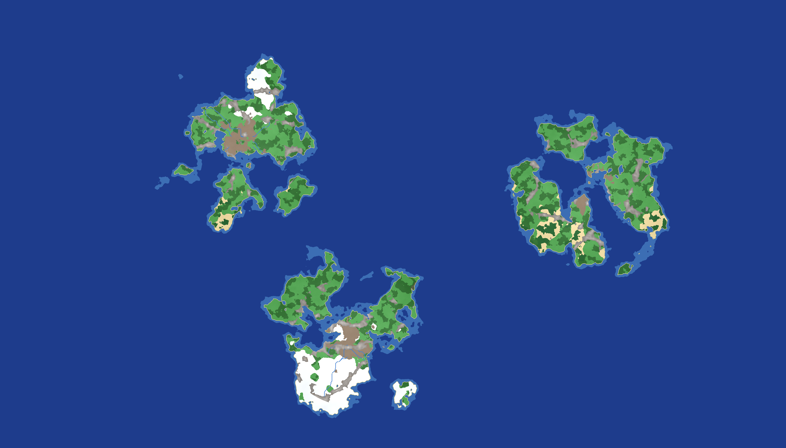

# uomapgen

**Procedural Ultima Online map generator for [ModernUO](https://github.com/modernuo/ModernUO), written in POSIX C.**

`uomapgen` generates classic UO `.mul` map data — terrain (`mapN.mul`), a static
index (`staidxN.mul`), and statics (`staticsN.mul`) — directly from a seed, using
[FastNoiseLite](https://github.com/Auburn/FastNoiseLite). A whole world is
described by its seed plus a handful of options, and the output is
**byte-identical for a given build and seed**, so maps are perfectly
reproducible. No game assets are modified and no network access is needed; the
only input is the client's `tiledata.mul` (read-only, optional).

A top-down **PNG preview** can be rendered without launching the client, and the
tool can emit a matching `map-definitions.json` snippet for ModernUO.



---

## Features

- **Continents** — one central landmass (`--continent`) or several separated by
  ocean (`--continents`), shaped from elevation noise for organic coastlines
  (bays, peninsulas, offshore islands), auto-scaled so each continent is coherent
  and kept off the map edge by an ocean margin.
- **Climate biomes** — temperature by latitude (snow at the poles, desert/jungle
  near the equator) plus moisture and elevation → snow, desert, jungle, swamp,
  forest, grass, hills.
- **Rivers** — carved downhill from high ground, meandering, routed **around**
  mountains, kept crossable with compact **fords**, with **lakes** forming where
  rivers sink inland.
- **Mountains** — ridged ranges (impassable rock) that rise above the ground,
  with carved walkable **passes** so valleys aren't sealed off.
- **Beaches** — sloped sand around every coast (no cliff at the shoreline).
- **Vegetation** — deterministic trees, cacti, boulders, reeds, plants and ground
  cover placed per biome, written as real statics.
- **Flat mode** — level all non-mountain ground to one Z (mountains keep their
  height) for building/testing.
- **Deterministic** — same build + seed/config ⇒ identical `.mul` bytes. No RNG,
  no threads, no environment variables.
- **Configurable** — every option is a CLI flag or a key in an optional INI-style
  config file (CLI overrides the file).

---

## Build

Requires a C11 compiler and CMake. **Build single-core (`-j1`)** — a project
convention:

```sh
cmake -S . -B build
cmake --build build -j1
./build/uomapgen --help
```

FastNoiseLite and `stb_image_write` are vendored under `third_party/` (see
`THIRD-PARTY.md`); there are no other dependencies.

---

## Quick start

```sh
# Small test map with a preview image and a ModernUO definition snippet
./build/uomapgen --seed 42 --preset test --out ./out \
    --preview ./out/preview.png --emit-mapdef

# Full Felucca-sized world: 3 organic continents, mountains, sparse rivers,
# climate biomes + vegetation (all enrichment is on by default)
./build/uomapgen --seed 2024 --preset felucca --continents --continent-count 3 \
    --mountains --rivers --river-density 10 --out ./out --preview ./out/world.png

# Flat, buildable version of the same world (mountains still elevated)
./build/uomapgen --seed 2024 --preset felucca --continents --mountains --rivers \
    --flat --out ./out_flat

# Drive everything from a config file (CLI flags still override it)
./build/uomapgen --config config/example.cfg --seed 7
```

---

## Command-line options

```
uomapgen 0.1.0 - procedural UO terrain generator for ModernUO

Usage: uomapgen [options]

Output is byte-identical for a given build + seed/config.
Writes map<N>.mul and (unless --terrain-only) staidx<N>.mul and
statics<N>.mul into the output directory.

Options:
  --seed <uint64>       Master seed (default 0). Same seed => same bytes.
  --config <file>       Read an INI-like config file first; CLI flags override it.
  --map <N>             Facet / file index -> map<N>.mul triplet (default 0).
  --width <tiles>       Map width, multiple of 8 (default 1024).
  --height <tiles>      Map height, multiple of 8 (default 1024).
  --preset <name>       'test' (1024x1024) or 'felucca' (7168x4096).
  --out <dir>           Output directory (default ./out).
  --sea-level <float>   Water threshold on elevation noise, [-1,1] (default 0.0).
  --frequency <float>   Base noise frequency (default 0.004).
  --octaves <int>       fBm octaves (default 5).
  --max-slope <int>     Max z step between adjacent land tiles (default 4).
  --land-z-max <int>    Highest land z from elevation, 0..127 (default 45).
  --water-z <int>       Flat z for water cells (default -5).

  Landmass shape:
  --continent           Radial falloff: one large central landmass ringed by ocean.
  --continent-radius <f>    Solid-land core radius, [0,1) (default 0.55; implies --continent).
  --continent-strength <f>  How hard edges fall to ocean (default 2.0; implies --continent).
  --continent-power <f>     Falloff curvature (default 2.0; implies --continent).
  --continents          Multiple continents (placed centers), ocean between them.
  --continent-count <n>     Number of continents (default 3; implies --continents).

  Elevation / mountains:
  --flat                Level non-mountain ground to one z (mountains keep their height).
  --flat-z <int>            The z for flat ground; mountains rise above it (default 0; implies --flat).
  --mountains           Add ridged mountain ranges (impassable rock peaks).
  --mountain-level <f>      Ridge threshold [0,1); higher = fewer/sparser ranges (default 0.70).
  --mountain-z <int>        Extra z at peaks, 0..127 (default 70).
  --mountain-scale <f>      Ridge frequency; smaller = bigger/broader ranges
                            (default: auto = frequency*0.5).

  Rivers:
  --rivers              Carve downhill rivers from high ground to the sea.
  --river-density <n>       How many rivers: number of sources, higher = more
                            (default: auto ~ (w+h)/400; e.g. 10 sparse, 120 dense).

  Enrichment (all ON by default; use the --no-* flags to disable):
  --no-biomes               Disable climate biomes (snow/desert/jungle/swamp).
  --temperature-bias <f>    Shift climate warmer(+)/colder(-) (default 0).
  --no-vegetation           Skip tree/rock/plant statics (statics stay empty).
  --tree-density <f>        Tree fraction of eligible cells, 0..1 (default 0.08).
  --rock-density <f>        Rock/boulder fraction, 0..1 (default 0.02).
  --plant-density <f>       Ground-cover fraction, 0..1 (default 0.05).
  --no-beaches              Skip sloped sand beaches around coasts.
  --beach-width <int>       Beach band width in tiles (default 4).
  --no-lakes                Skip lakes at inland river sinks.
  --no-passes               Skip carving walkable passes through mountains.

  Output:
  --tiledata <path>     tiledata.mul used to sanity-check tile flags
                        (default ./ref/UONewDawn/tiledata.mul; optional).
  --preview <file.png>  Also render a top-down preview image.
  --emit-mapdef         Also write map-definitions.snippet.json for ModernUO.
  --terrain-only        Write only map<N>.mul (skip staidx/statics).
  --help                Show this help and exit.
  --version             Show version and exit.
```

> **Note:** `uomapgen` never reads environment variables. All input is CLI flags
> and the optional config file.

---

## Config file

Instead of (or alongside) flags, use an INI-style file. Keys mirror the long
options with `-` or `_`; `#` or `;` start comments. CLI flags override the file.
See [`config/example.cfg`](config/example.cfg).

```ini
seed       = 2024
preset     = felucca
continents = true
continent_count = 3
mountains  = true
rivers     = true
river_density = 10
tree_density  = 0.08
```

---

## How it works

For each tile the generator computes an elevation field (fBm noise) plus a
continent falloff to decide land vs. sea, derives a biome from temperature
(latitude + noise + elevation) and moisture, and picks a land tile and Z. Then
successive passes carve meandering rivers (with fords and lakes), raise ridged
mountains (with passes), slope beaches onto every coast, and scatter vegetation
statics per biome. Everything is seeded from a single master seed via
`splitmix64`, iterated in a fixed order, and written little-endian by hand, so
output is byte-identical per build.

See [`docs/FORMAT.md`](docs/FORMAT.md) for the exact `.mul` byte layout and
[`docs/DETERMINISM.md`](docs/DETERMINISM.md) for the reproducibility contract.

---

## Using the maps

**ModernUO:** copy `mapN.mul`, `staidxN.mul`, `staticsN.mul` into a directory
listed in the server's `dataDirectories`. The map's `width`/`height` **must
match** the entry in `Data/map-definitions.json` — use `--emit-mapdef` to get a
matching snippet, or `--preset felucca` for a drop-in `map0`.

**Viewing without a server:** render a `--preview` PNG, or point a tool like
**UOFiddler** at a UO client directory that contains the generated triplet (plus
the client's `tiledata.mul`, `radarcol.mul`, `hues.mul`, art) and open the Map
tab. Back up the client's original `map0/staidx0/statics0` first if you overwrite
them.

---

## Project layout

```
CMakeLists.txt          build (always -j1)
include/uomapgen/*.h    module headers
src/*.c                 config, noise, biome, terrain, vegetation,
                        mapwriter, statics, preview, mapdef, io, main
third_party/            vendored FastNoiseLite + stb_image_write
config/example.cfg      annotated sample config
docs/FORMAT.md          .mul byte layout
docs/DETERMINISM.md     reproducibility rules
```

---

## License

The `uomapgen` source is provided as-is. Vendored third-party components keep
their own licenses (FastNoiseLite: MIT; stb_image_write: public domain / MIT) —
see [`THIRD-PARTY.md`](THIRD-PARTY.md). Ultima Online and its data files are the
property of their respective owners and are not included in this repository.
